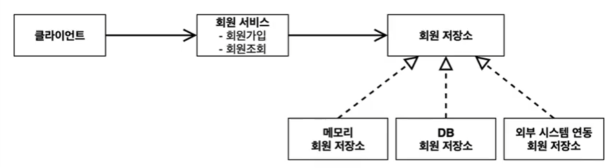

### 1. 프로젝트 생성

* start.spring.io 에서 접속해 가장 기본적인 스프링 프로젝트 생성
  * java11, spring-boot 2.7.16, jar
  * 별도 dependency 설정 x

* 우선 순수 자바만을 활용하여 진행. 스프링사용은 나중에 진행.

### 2. 비즈니스 요구사항과 설계

* 회원 
  * 회원을 가입하고 조회할 수 있다.
  * 회원은 일반과 VIP 두가지 등급이 있다.
  * 회원 데이터는 자체 DB를 구축할 수 있고, 외부 시스템과 연동할 수 있다.(미확정)


* 주문과 할인 정책
  * 회원은 상품을 주문 할 수 있다.
  * 회원 등급에 따라 할인 정책을 적용할 수 있다.
  * 할인 정책은 모든 VIP 는 1000원을 할인해주는 고정 금액 할인을 정용해달라. (나중에 변경 가능)
  * 할인 정책은 변경 가능성이 높다. 회사의 기본할인 정책을 아직 정하지 못했고, 오픈 직전까지 고민을 미루고 싶다. 최악의 경우 할인을 적용하지 않을 수 도 있다.(미확정)
  

```text
요구사항을 보면 회원 데이터, 할인 정책 같은 부분은 지금 결정하기 어려운 부분
=> 인터페이스를 만들고 구현체를 언제든지 갈아 끼울 수 있도록 설계
```

### 3. 회원 도메인 설계

* 회원 도메인 요구사항
  * 회원을 가입하고 조회할 수 있다.
  * 회원은 일반과 VIP 두가지 등급이 있다.
  * 회원 데이터는 자체 DB를 구축할 수 있고, 외부 시스템과 연동할 수 있다.(미확정)
  
* 회원 도메인 협력관계



* 회원 클래스 다이어그램


* 회원 객체 다이어그램 (메모리간의 참조가 어떻게 되는지 보여주는 다이어그램)
```text
  * [클라이언트] => [회원서비스(MemberServiceImpl)] => [메모리 회원저장소(xxxMemberRepository)]
```


