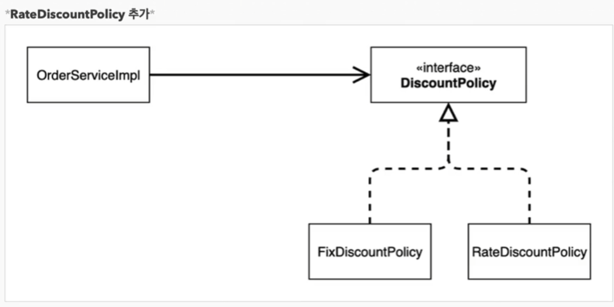
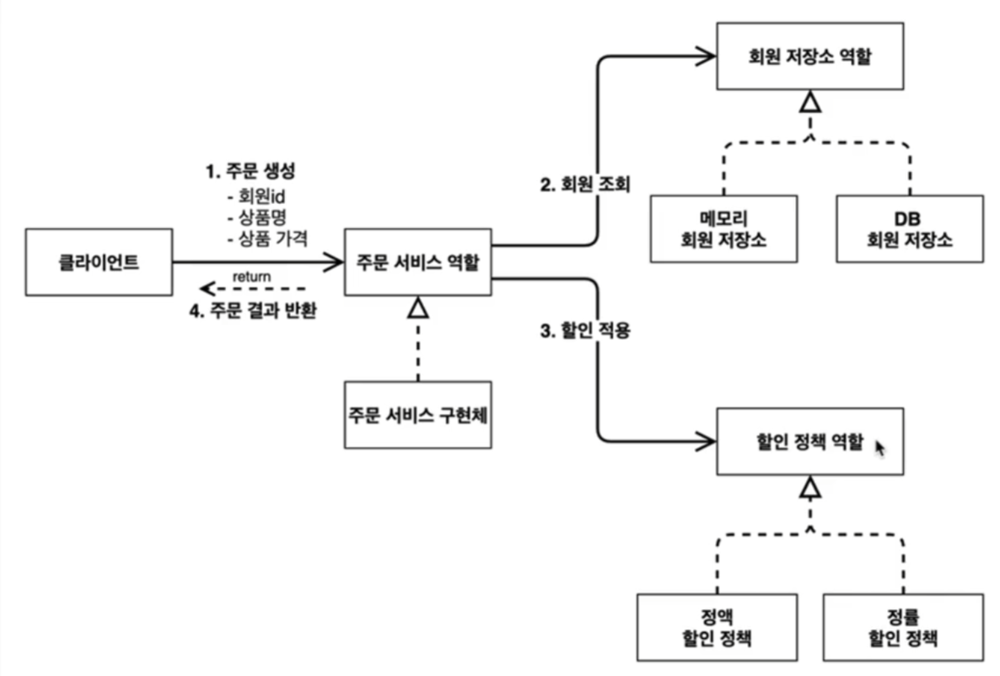
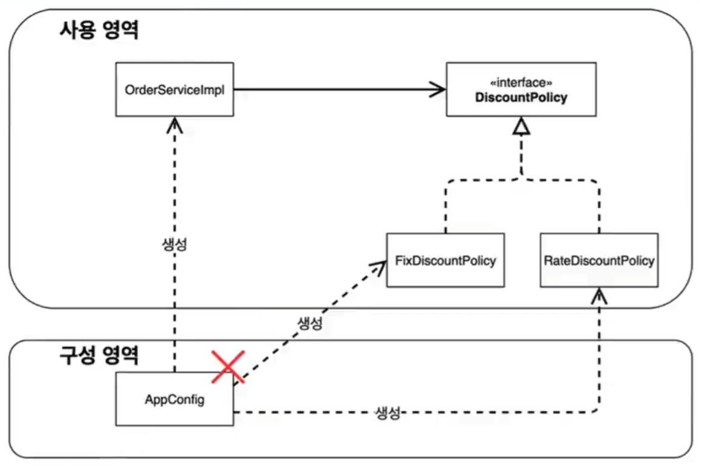
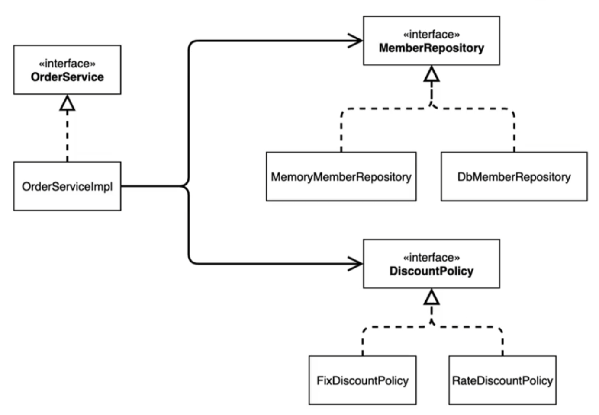
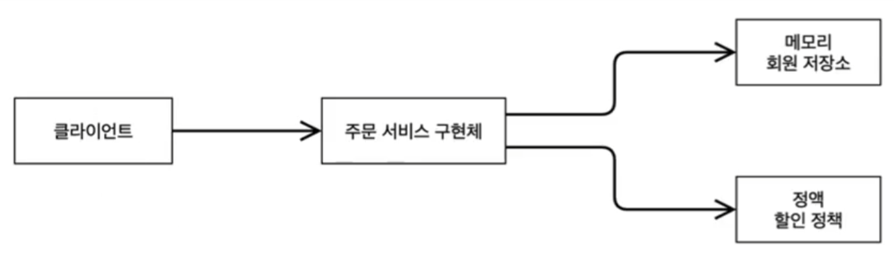

## 객체 지향 원리 적용

---
### 1. 새로운 할인 정책 개발

* 객체지향 설계 원칙을 준수하였기 때문에 유연한 대처가능


* 새로운 할인 정책 적용
```java
public class OrderserviceImpl implements OrderService {

  private final MemberRepository memberRepository = new MemoryMemberRepository();
  private final DiscountPolicy discountPolicy = new RateDiscountPolicy();
}
//    private final DiscountPolicy discountPolicy = new FixDiscountPolicy();
```

* **문제점 발견**
  * 역할과 구현을 충실하게 분리했다 -> OK
  * 다형성도 활용하고, 인터페이스와 구현객체를 분리했다 -> OK
  * OCP, DIP같은 객체지향 설계 원칙을 충실히 준수했다 -> 그렇게 보이지만 사실은 아니다
  * DIP : Dependency Inversion Principle, 객체는 구체가 아닌 추상화에 의존해야한다.
    * 주문서비스 클라이언트(`OrderServiceImpl`)sms `DiscountPolicy`인터페이에 의존하면서 DIP를 지킨 것 처럼 보이지만
    * 추상(인터페이스) 뿐만 아니라 **구체(구현) 클래스에도 의존**하고있다
      * 추상(인터페이스)의존 : `DiscountPolicy`
      * 구체(구현) 클래스 : `FixDiscountPolicy`, `RateDiscountPolicy`  
  * OCP : Open-Closed Principle : 확장에 대해 열려있고, 수정에 대해 닫혀있어야 한다.   
    => **`FixDiscountPolicy`를 `RateDiscountPolicy`로 변경하기 위해, `OrderServiceImpl`의 소스코드도 함께 변경해야 함**  
    => 기능을 확장해서 변경하려면, 클라이언트 코드에 영향을 준다  
    => **OCP 위반**

* **인터페이스에만 의존하도록 코드 변경**
  ```java
  public class OrderserviceImpl implements OrderService{
  
    private final MemberRepository memberRepository = new MemoryMemberRepository();
  //    추상클래스(인터페이스)에만 의존하도록 변경
    private DiscountPolicy discountPolicy;
  }
  ```
  * 구현체가 없기 때문에 실행 시 NPE 발생

* **해결방안**
  * 누군가 클라이언트인 `OrderServiceImpl`에 `DiscountPolicy`의 구현 객체르 대신 생성하고 주입해줘야 한다.


### 2. 관심사의 분리
* 어플리케이션이 하나의 공연이라고 한다면, 배우(구현체)는 배우 역할(인터페이스)에 만 집중해야하지, 어떤 배우가 출연할지는 기획자의 역할!
* 책임을 확실히 분리하자


### 3. AppConfig 등장
* 어플리케이션의 전체 동작 방식을 구성(config)하기 위해, **구현 객체를 생성**하고 **연결**하는 책임을 가지는 별도의 설정클래스 만들기
  ```java
    public class AppConfig {
        public MemberService memberService(){
        // 생성자 주입
            return new MemberServiceImpl(new MemoryMemberRepository());
        }
    }
  ```
* `memberServiceImpl`입장에서 보면 의존관계를 마치 외부에서 주입하주는 것 같다고 해서 DI(Dependency Injection) :의존관계 주입. 의존성 주입

> 정리
> * AppConfig(공연 기획자)를 통해 관심사를 확실히 분리
> * AppConfig는 구체 클래스를 선택하고, 어플리케이션이 어떻게 동작할지 전체 구성을 책임진다.
> * `OrderServiceImpl`은 기능을 실행하는 책임만 지면 된다!


### 4. AppConfig 리팩터링
- 현재 AppConfig에는 **중복**이 있고, **역할**에 따른 **구현**이 잘 안보임  
  => AppiConfig에 이런것들이 드러나게 하는게 중요!

* 기대하는 그림


  ```java
    public class AppConfig {
        /**
         * 2 AppConfig 리팩토링 전
         * - 역할이 명확하지 않고 중복된 코드들이 있음
         */
    //    public MemberService memberService(){
    //        // 생성자 주입
    //        return new MemberServiceImpl(new MemoryMemberRepository());
    //    }
    //
    //    public OrderService orderService(){
    //        return new OrderserviceImpl(new MemoryMemberRepository(), new FixDiscountPolicy());
    //    }
        /** FIXME 역할이 잘 드러나도록 변경! (단축키 ctrl + alt + M 2번 누르면 리턴타입 선택가능! 구체클래스x 인터페이스로 선택! )
         - 장점
            - 메소드 이름만 봐도 역할이 구분되고, 그 구현이 어떤건지 한눈에 들어옴 + 중복코드가 사라짐.
            - 이후 구현체가 바뀌었을 때, 이 곳에서만 관리해주면 된다.
         */
    
        /* MemberService 역할 */
        public MemberService memberService(){
            // 생성자 주입
    //        return new MemberServiceImpl(new MemoryMemberRepository());
            return new MemberServiceImpl(memberRepository());
        }
        /* MemberRepository 역할 */
        private MemberRepository memberRepository() {
            return new MemoryMemberRepository();
        }
        /* OrderService 역할 */
        public OrderService orderService(){
            return new OrderserviceImpl(memberRepository(), discountPolicy());
        }
        /* DicountPolicy 역할 */
        public DiscountPolicy discountPolicy(){
            return new FixDiscountPolicy();
        }
    }

  ```
* new MemoryMemberRepository() 중복코드 제거됨
* 구현체 변경 시 한 부분만 변경하면 됨.
* `AppConfig`에 역할과 구현클래스를 한눈에 확인 가능!


### 5. 새로운 구조와 할인 정책 적용
* 정액할인 => 정률할인 정책으로 변경해보자
* **사용영역 코드는 바꿀필요 없고, 구성영역 코드만 변경해주면 된다!**  

  ```java
   public class AppConfig {
      // 생략
      
          /* DicountPolicy 역할 */
          public DiscountPolicy discountPolicy(){
              // RateDiscountPolicy로 변경!
              return new RateDiscountPolicy();
          }
      }
  ```
  

### 6. [정리] 좋은 객체 지향 설계의 5가지 원칙의 적용
* 여기서는 3가지 SRP, DIP, OCP적용


#### SRP : 단일 책임 원칙
> 한 클래스는 하나의 책임만 가져야 한다.

* 클라이언트 객체는 직접 구현 객체르 생성하고, 연결하고, 실행하는 다양한 책임을 가지고 있었음
* SRP 단일 책임 원칙을 따르면서 관심사를 분리함.
* 구현 객체를 생성하고 연결하는 책임은 AppConfig가 담당
* 클라이언트 객체는 실행하는 책임만 담당

#### DIP : 의존관계 역전 원칙
> 프로그래머는 "추상화에 의존해야지, 구체화에 의존하면 안된다."  
> 의존성 주입은 이 원칙을 따르는 방법 중 하나다 
> <=> 구체클래스에 대한 선택은 외부에서 넣어줘야한다! 

* 새로운 할인 정책을 개발하고, 적용하려고 하니 클라이언트 코드도 함꼐 변경해야 했다.  
왜냐하면 기존 클라이언트 코드 (`OrderServiceImpl`)는 DIP를 지키며 추상화 인터페이스(`DiscountPolicy`) 의존하는 것 같았지만,
구체화 구현 클래스(`FixDiscountPolicy`)에도 함꼐 의존했다.
* 클라이언트 코드를 `DiscountPolicy`추상화 인터페이스에만 의존하도록 코드를 변경했다.
* 하지만 클라이언트 코드는 인터페이스만으로는 아무것도 실행할 수 업삳.
* AppConfig가 `FixDiscountPolicy`객체 인스턴스를 클라잉너트 코드 대신 생성해서 클라이언트 코드에 의존관계를 주입했다.
이렇게 해서 DIP원칙을 따르면서도 문제도 해결했다.

#### OCP : 개방-폐쇄원칙
> 소프트웨어 요소는 확장에는 열려 있으나 변경에는 닫혀 있어야 한다.

* 다형성 사용하고 클라이언트가 DIP를 지킴명 OCP를 지킬 수 있는 조건 충족
* 애플리케이션을 사용 영역과 구성 영역으로 나눔
* AppConfig가 의존관계를 `FixDiscountPolicy` -> `RateDiscountPolicy`로 변경해서 클라이언트 코드에 주입하므로 클라이언트 코드는 변경하지 않아도 됨
* **소프트웨어 요소를 새롭게 확장해도 사용 영역의 변경은 닫혀있다**

### 7. [정리] IoC, DI 그리고 컨테이너

#### 제어의 역전(Inversion of Control)
> 내가 호출하고 제어하는 것이 아니라 프레임워크에서 대신 호출해 줌
> (Spring에만 국한된 이야긴 아님)

* 프로그램 제어권이 `AppConfig`에게 넘어가고, 구현체들은 자기 로직만수행

#### 의존관계 주입(Dependency Injection)
> `정적인 클래스 의존관계`와 실행시점에 결정되는 `동적인 객체(인스턴스) 의존관계` 둘을 분리해서 생각해야한다

* 정적인 클래스 의존관계 : 단순히 import 코드만 보고 의존관계 파악가능. 실제 어떤객체(구현체)가 주입 될지 알 수 없음
  * 클래스 다이어그램
  
* 동적인 객체 인스턴스 의존관계 : 어플리케이션 실행 시점에 실제 생성된 객체 인스턴스 참조가 연결된 의존관계
  * 객체 다이어그램
  
  
> **실행시점(런타임)** 에 **외부**에서 실제 **구현객체를 생성**하고, **클라이언트에 전달**해서, 클라이언트와 서버의 실제 의존관계가 되는 것을 **의존관계 주입** 이라고 한다  
> - 객체 인스턴스를 생성하고, 그 **참조값**을 전달해서 연결된다 (java에선 객체들은 서로 참조값으로 연결되어있음)
> - DI를 사용하면 클라이언트 코드를 변경하지 않고, 클라이언트가 호출하는 대상의 타입 인스턴스를 변경 가능(ex: 정액할인 => 정률할인 변경)
> - DI를 사용하면 적정인 클래스 의존관계를 변경하지 않고, 동적인 객체 인스턴스 의존관계를 쉽게 변경할 수 있다

#### IoC 컨테이너, DI 컨테이너
* AppConfig처럼 객체를 생성하고 관리하면서 의존관계를 연결해주는 것을 `IoC 컨테이너` 또는 `DI 컨테이너`라 한다
* 의존관계 주입에 초점을 맞춰서 최근엔 주로 `DI 컨테이너`라 한다 => ex:Spring이 DI 컨테이너 역할 을 해줌
* 어셈블러, 오브젝트 팩토리라고 하기도 함

### 8. 스프링으로 전환하기
* AppConfig.java  스프링기반으로 변경
  * @Configuration, @Bean 어노테이션 추가
  * 호출하는 곳에서도 ApplcationContext(스프링 컨테이너) 객체 생성 후 꺼내서 사용

* `ApplcationContext`를 스프링 컨테이너라 함
* 기존엔 `AppConfig`를 사용해, 직접 객체를 생성하고 DI를 했지만, 이젠 스프링 컨테이터를 통해서 사용한다
* 스프링 컨테이너는 `@Configuration`이 붙은 클래스(AppConfig)를 설정(구성)정보로 사용한다. 여기서 `@Bean`표시가 된 메소드를 모두 호출해서, 반환된 객체를 스프링 컨테이너에 등록한다.
* 이렇게 스프링 컨테이너에 등록된 객체를 `스프링 빈`이라 한다
* 스프링 빈은 `@Bean`이 붙은 메서드 명을 스프링 빈의 이름으로 사용(default)
* applcationContext.getBean()메소드로 빈을 찾아서 사용

> ? 스프링 컨테이너를 사용하면 어떤 장점이 있을까 ?   
> => 앞으로 배울예정!