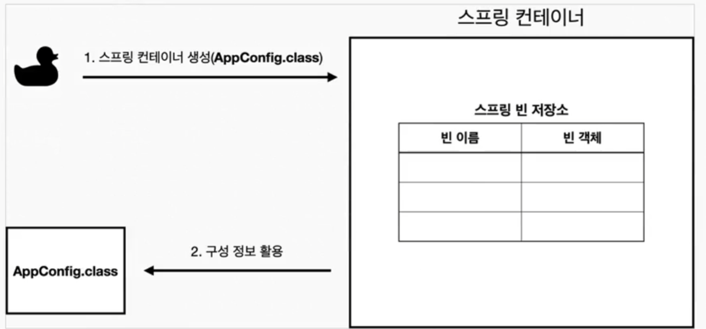
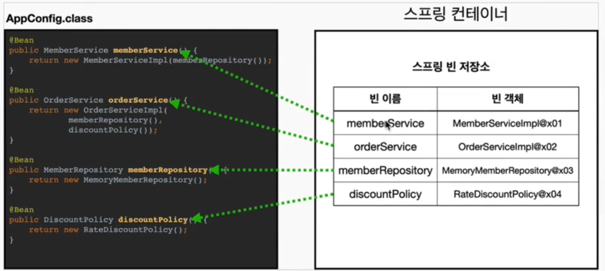
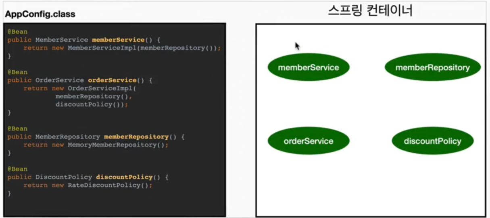
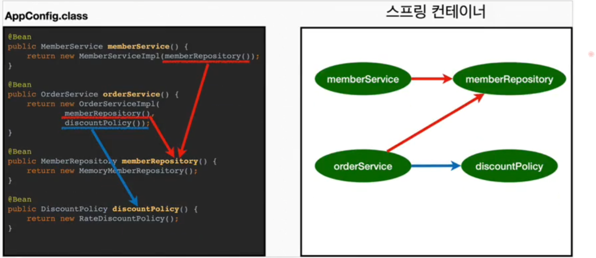

## 스프링 컨테이너와 스프링 빈

### 스프링 컨테이너 생성
```java
// 스프링 컨테이너 생성
ApplicationContext ac = new AnnotationConfigApplicationContext(AppConfig.class);
```
* `ApplicationContext` : 스프링 컨테이너라고 하며, 인터페이스이다. => 구현체를 선택할 수있음
  * 어노테이션 기반 or xml 기반 설정파일로 스프링 컨테이너를 생성

> 참고 : 스프링 컨테이너를 부를 때, `BeanFactory`와 `ApplicationContext`로 구분할 수 있지만, 일반적으로 `ApplicationContext`를 의미 함

### 스프링 컨테이너 생성과정

#### 1. 스프링 컨테이너 생성


#### 2. 스프링 빈 등록

* 빈 이름을 직접 부여할 수 도있음 `@Bean(name="memberService2")`
* 빈 이름은 모두 다른이름으로 부여해야 함


#### 3. 스프링 빈 의존관계 설정 - 준비


#### 4. 스프링 빈 의존관계 설정 - 완료

* 스프링 컨테이너는 설정정보를 참고하여 의존관계 주입(DI)
* 단순 자바코드를 호출하는 것과 차이가 있다. (싱글톤 컨테이너에서 설명)
> 참고 : 스프링은 빈을 생성하고, 의존관계를 주입하는 단계가 나누어져있다. 
> 그러나 위의 예시 코드처럼 스프링 빈을 등록하면, 생성자를 호출하면서 의존관계 주입도 한번에 처리된다.
> 자세한 내용은 의존관계 자동주입 때 설명!


### 스프링 빈 조회 - 기본

1. ac.getBean(빈이름, 타입);
2. ac.getBean(타입);
=> 조회 대상 스프링 빈이 없으면 `NoSuchBeanDefinitionException` 발생  
* 실습 : `beanfind/ApplicationContextBasicFindTest.java`

### 스프링 빈 조회 - 동일한 타입이 둘 이상

1. 같은 타입의 스프링 빈이 둘 이상일 경우, 오류발생 ! => 빈이름 지정
2. ac.getBeansOfType(타입) : 해당 타입의 모든 빈 조회 => 자동 의존관계 주입(@Autowired) 할 때 이런기능이 적용됨  
* 실습 : `beanfind/ApplicationContextSameBeanFindTest.java`

### 스프링 빈 조회 - 상속관계
1. 부모타입으로 조회하면 자식 타입도 함께 조회한다
* 실습 : `beanfind/ApplicationContextExtendsFindTest.java`