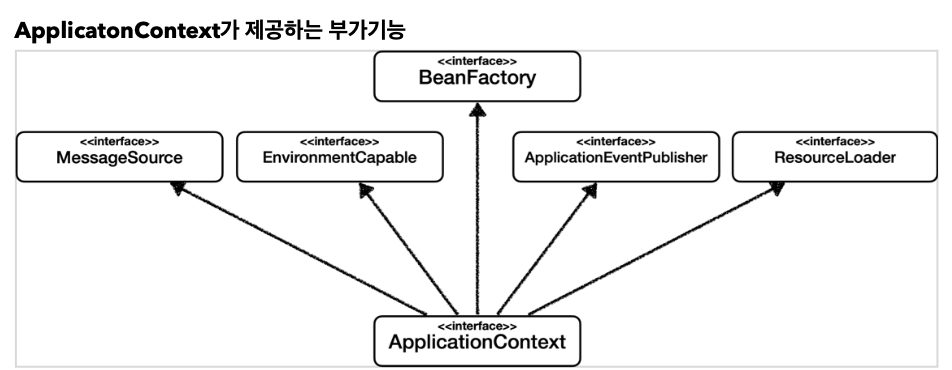
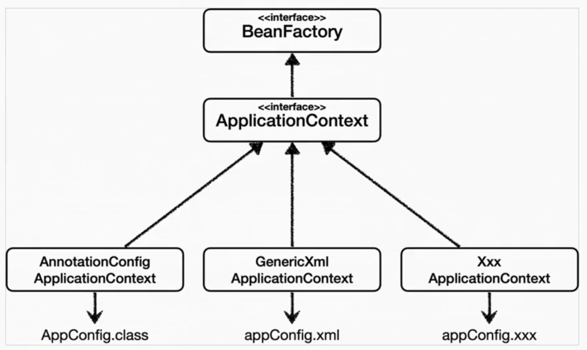
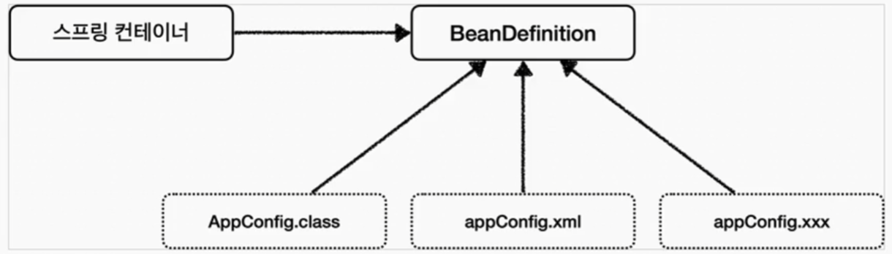
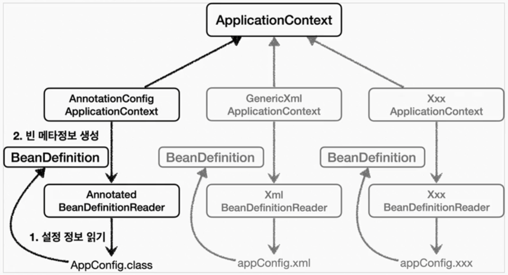

## 스프링 컨테이너와 스프링 빈

### 스프링 컨테이너 생성
```java
// 스프링 컨테이너 생성
ApplicationContext ac = new AnnotationConfigApplicationContext(AppConfig.class);
```
* `ApplicationContext` : 스프링 컨테이너라고 하며, 인터페이스이다. => 구현체를 선택할 수있음
  * 어노테이션 기반 or xml 기반 설정파일로 스프링 컨테이너를 생성

> 참고 : 스프링 컨테이너를 부를 때, `BeanFactory`와 `ApplicationContext`로 구분할 수 있지만, 일반적으로 `ApplicationContext`를 의미 함

### 스프링 컨테이너 생성과정

#### 1. 스프링 컨테이너 생성


#### 2. 스프링 빈 등록

* 빈 이름을 직접 부여할 수 도있음 `@Bean(name="memberService2")`
* 빈 이름은 모두 다른이름으로 부여해야 함


#### 3. 스프링 빈 의존관계 설정 - 준비


#### 4. 스프링 빈 의존관계 설정 - 완료

* 스프링 컨테이너는 설정정보를 참고하여 의존관계 주입(DI)
* 단순 자바코드를 호출하는 것과 차이가 있다. (싱글톤 컨테이너에서 설명)
> 참고 : 스프링은 빈을 생성하고, 의존관계를 주입하는 단계가 나누어져있다. 
> 그러나 위의 예시 코드처럼 스프링 빈을 등록하면, 생성자를 호출하면서 의존관계 주입도 한번에 처리된다.
> 자세한 내용은 의존관계 자동주입 때 설명!


### 스프링 빈 조회 - 기본

1. ac.getBean(빈이름, 타입);
2. ac.getBean(타입);
=> 조회 대상 스프링 빈이 없으면 `NoSuchBeanDefinitionException` 발생  
* 실습 : `beanfind/ApplicationContextBasicFindTest.java`

### 스프링 빈 조회 - 동일한 타입이 둘 이상

1. 같은 타입의 스프링 빈이 둘 이상일 경우, 오류발생 ! => 빈이름 지정
2. ac.getBeansOfType(타입) : 해당 타입의 모든 빈 조회 => 자동 의존관계 주입(@Autowired) 할 때 이런기능이 적용됨  
* 실습 : `beanfind/ApplicationContextSameBeanFindTest.java`

### 스프링 빈 조회 - 상속관계
1. 부모타입으로 조회하면 자식 타입도 함께 조회한다
* 실습 : `beanfind/ApplicationContextExtendsFindTest.java`

### BeanFactory와 ApplicationContext

#### BeanFactory
* 스프링 컨테이너의 최상위 인터페이스
* 스프링 빈을 관리하고 조회하는 역할 을 담당한다.
  * `getBean()`제공
* 지금까지 사용했던 기능들은 대부분 BeanFactory가 제공하는 기능

#### ApplicationContext
* BeanFactory 기능을 모두 상속받아서 제공한다.
* 빈을 관리하고 검색하는 기능을 BeanFactory가 제공해주는데, 그러면 둘의 차이가 뭘까? 
  * 애플리케이션을 개발할 때는 빈은 관리하고 조회하는 기능은 + 수많은 부가기능이 필요
  ```text
  ** ApplicationContext가 제공하는 부가기능 **
  1. 메세지 소스를 활용한 국제화 기능
    - ex: 한국에서 들어오면 한국어, 영어권이면 영어로 출력
  2. 환경변수
    - 로컬, 개발, 운영 등 구분해서 처리
  3. 애플리케이션 이벤트
    - 이벤트를 발행하고 구독하는 모델을 편리하게 지원
  4. 편리한 리소스 조회
    - 파일, 클래스패스, 외부 등에서 리소스를 편리하게 조회
  ```

  > 정리   
  > BeanFactory나 Application을 스프링 컨테이너라고 한다.  
  > ApplicationContext = 빈관리기능(BeanFactory 상속) + 편리한 부가기능
  > 

#### 다양한 설정 형식 지원 - java 코드, xml
* 스프링 컨테이너는 다양한 형식의 설정 정보를 받아드릴 수 있게 유연하게 설계되어있다.
  * 자바코드, xml, Groovy 등등
  
  * xml 설정 장점 : 컴파일 없이 빈 설정 정보 변경 가능 
  * 최근엔 대부분 어노테이션방식의 설정 사용

### 스프링 빈 설정 메타 정보 - BeanDefinition
* `BeanDefinition` 추상화를 통해 => 다양한 설정 형식을 지원할 수 있는 것!
* **역할과 구현을 개념적으로 나눈 것** 
  * xml을 읽어와 BeanDefinition 생성
  * java 코드를 읽어와 BeanDefinition 생성
* `BeanDefinition` : 빈 설정 메타 정보
  * `@Bean`, `<bean>` 마다 하나씩 메타정보가 생성됨.
* 스프링 컨테이너는 이 메타정보를 기반으로 스프링 빈을 생성한다
  * => 스프링 컨테이너 자체는 BeanDefinition(interface, 추상화)에만 의존함!


#### 코드레벨에서 살펴보기

* `AnnotationConfigApplicationContext`   
 : `AnnotatedBeanDefinitionReader`를 사용해 `AppConfig.class`를 읽고 `BeanDefinition`을 생성 (설정파일 읽듯이)
* `GenericXmlApplicationContext`  
 : `XmlBeanDefinitionReader`를 사용해 `appConfig.xml`을 읽고 `BeanDefinition`을 생성
* 새로운 형식의 설정정보가 추가하면, 마찬가지로 `XxxBeanDefinitionReader`를 만들어 `BeanDefinition`을 생성하면 된다.(ex json?)


#### BeanDefinition 살펴보기
**BeanDefinition 정보**
* BeanClassName : 생성할 빈의 클래스 명(java 설정 처럼, 팩토리 역할의 빈을 사용하면 없음 null)
* factoryBeanName: 팩토리 역할의 빈을 사용할 경우 이름. ex:appConfing
* factoryMethodName : 빈을 생성할 팩토리 메소드 지정. ex:memberService
* Scope : 디폴트 - 싱글톤
* lazyInit : 스프링 컨테이너 생성 시 빈 생성 or 실제 빈을 사용할 때 생성 지연 여부
* InitMethodName : 빈을 생성하고, 의존관계를 적용한 뒤에 호출되는 초기화 메소드 명
* DestroyMethodName : 빈의 생명주기가 끝나서 제거 직전 호출되는 메소드 명
* Constructor arguments, Properties : 의존관계 주입에서 사용(java 설정 처럼 팩토리 역할의 빈을 사용하면 없음)

**정리**
* 스프링의 다양한 형태의 설정 정보를 BeanDefinition으로 추상화해서 사용한다! 매커니즘에 대한 이해!
* BeanDefinition을 직접 생성해서 스프링 컨테이너에 등록 할 수도 있지만, 직접 정의하거나 사용할 일은 거의 없음!