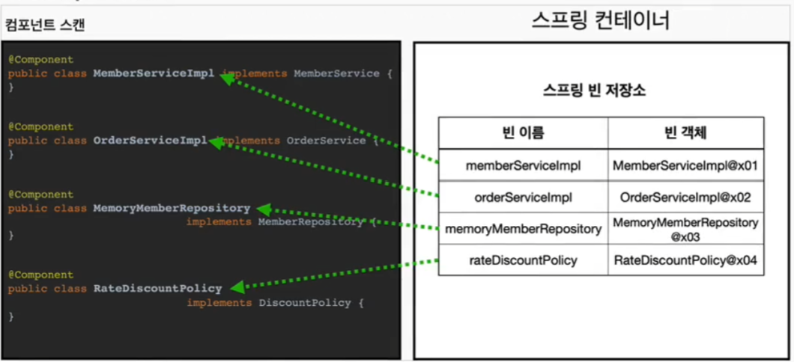
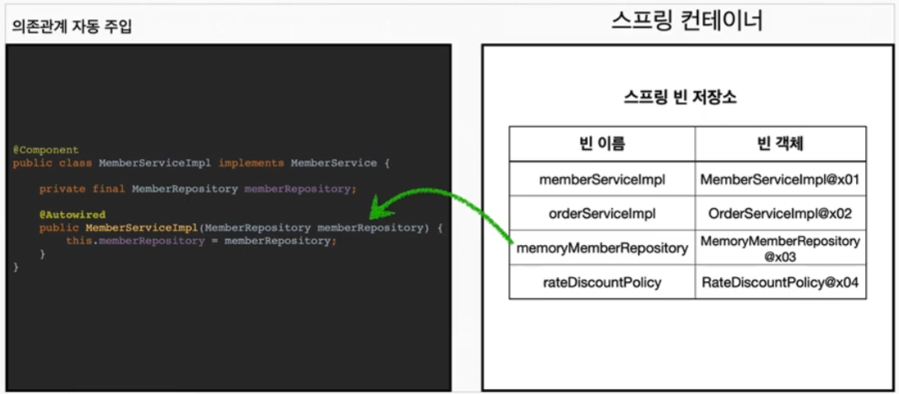

## 컴포넌트 스캔

### 컴포넌트 스캔과 의존관계 자동 주입 시작하기
1. 설정파일 만들기 (AutoAppConfig.java)
2. @Confiuration 추가 (스프링 설정 파일)
3. @Component 추가

    ```java
    @Configuration  // 스프링 설정정보를 가진 빈, @Configuration도 자동 빈 등록 대상
    @ComponentScan( // 컴포넌트 스캔
            // Configuration 어노테이션 제외 => AppConfig.java, 테스트용 설정 제외하려고!
            // 실무에서 제외하진않음!
            excludeFilters = @ComponentScan.Filter(type = FilterType.ANNOTATION, classes = Configuration.class)
    )
    public class AutoAppConfig {
    }
    ```
   * 기존 `AppConfig.java`와 다르게 `@Bean`으로 등록한 클래스가 없음!
   * 참고 : @Configuration이 붙은 클래스도 빈 등록 대상이 된다 ( 내부에 @Component이 있음)

4. 사용할 각 클래스(구현체)에 `@Component` 추가 (Bean 등록을 별도로 하지않아도 됨)
   * MemoryMemberRepository, RateDiscountPolicy, MemberServiceImpl ..
   * `@Component`를 사용해 스프링 빈으로 자동으로 등록을 할 뿐, 의존관계 주입을 해주진 않음
5. @Autowired를 사용해 의존 관계 자동 주입!
   * @Autowired를 사용하면 스프링 컨텍스트에 등록된 빈 중  타입에 맞는 빈을 찾아와서 의존관계 자동주입
   * 생성자에 `@Autowired`를 사용하면 여러 의존관계도 한번에 주입 가능
   ```java
    @Component
    public class MemberServiceImpl implements MemberService {
    
        private final MemberRepository memberRepository;
   
        // 자동주입하는 생성자에 @Autowired 추가
        @Autowired  // ac.getBean(MemberRepository.class)
        public MemberServiceImpl(MemberRepository memberRepository) {
            this.memberRepository = memberRepository;
        }
        //...
    }
   ```
   * `AppConfig.java`에서 `@Bean`으로 직접 설정 정보를 작성하고, 의존 관계도 명시했지만, 이러한 설정 정보 자체가 없음
   * `@Component`클래스에서 직접 해결 
     * `@Autowired` 사용해 자동 주입!

   #### Component Scan 동작 원리
   
   * `@ComponentScan`은 `@Component`가 붙은 모든 클래스를 스프링 빈으로 등록
   * 이때 스프링 빈의 기본 이름은 클래스 명을 사용하되 맨 앞글자만 소문자를 사용
     * **Default 빈 이름 기본 전략** : 클래스 - MemberServiceImpl => 빈이름 - memberServiceImpl 
     * **빈 이름 직접 지정** : `@ComponentScan("memberService2")` 로 설정 가능

   #### Autowired 동작 원리
   
   * 생성자에 `@Autowired`를 지정하면, 스프링 컨테이너가 자동으로 해당 스프링 빈을 찾아서 주입
   * Default 조회 전략은 타입이 같은 빈을 찾아서 주입한다.
     * `getBean(MemberRepository.class)`와 동일하다고 보면 됨
     * 같은 타입이 여러개일 경우 ? 뒤에 강의에서 !
     
### 탐색 위치와 기본 스캔 대상
   
#### 탐색할 패키지의 위치 지정
   
```java
 @Configuration
 @ComponentScan(
         // 컴포넌트 스캔 탐색 시작 위치 지정 (지정하지 않으면 전체 소스 스캔 (라이브러리 포함))
         basePackages="hello.core",
         excludeFilters = @ComponentScan.Filter(type = FilterType.ANNOTATION, classes = Configuration.class)
 )
 public class AutoAppConfig {
 }
 ```
 * `basePackages` : 컴포넌트 스캔 탐색 시작 위치 지정 (지정하지 않으면 전체 소스 스캔 (라이브러리 포함))
   * `basePackages={"hello.core","hello.service"}` 같이 여러개 지정 가능
 * `basePackageClasses` : 지정한 클래스의 패키지를 탐색 위치로 시작
   * `basePackageClasses = AutoAppConfig.class` => `AutoAppConfig.class`가 속한 `hello.core` 패키지부터 시작
 * basePackage를 지정하지 않으면 Default는 `@ComponentScan`이 붙은 설정정보 클래스의 패키지가 시작 위치

**권장하는 방법**
* 패키지 위치를 지정하는게 아니라, 설정 정보 클래스 파일의 위치를 프로젝트 최상단에 두는 것. 
* 스프링 부트도 이 방법을 기본으로 제공 (`@SpringBootApplication`이 프로젝트 시작 루트 위치에 기본으로 생성)


#### 컴포넌트 스캔의 기본 대상
* `@Component` : 컴포넌트 스캔에서 사용
* `@Controller` : 스프링 MVC 컨트롤러에서 사용
* `@Service` : 스프링 비즈니스 로직에서 사용
* `@Repository` : 스프링 데이터 접근 계층에서 사용
* `@Configuration` : 스프링 설정 정보에서 사용

> 참고 : 어노테이션에서는 상속관계라는 것이 없음. 어노테이션이 특정 어노테이션을 포함하고 있는 것(ex: @Service 정의를 보면 @Component이 포함 되어 있음)은 java언어가 지원하는 것이 아니라 스프링이 지원하는 기능
    
컴포넌트 스캔 용도 뿐만 아니라 스프링이 부가 기능을 수행하는 어노테이션들이 있음
* `@Controller` : 스프링 MVC 컨트롤러로 인식
* `@Repository` : 스프링 데이터 접근 계층으로 인식하고, 데이터 계층의 예뢰를 스프링의 **추상화**된 예외로 변환해줌
  * DB별 다른 예외가 발생 할 수 있는데, 이로 인해 다른 계층의 코드가 흔들리지 않도록 스프링의 추상화된 에러로 변환하여 반환
* `@Configuration` : 스프링 설정 정보로 인식하고, 스프링 빈이 싱글톤을 유지하도록 추가 처리
* `@Service` : 사실 특별한 부가기능 x, 개발자들이 핵심 비지니스 계층을 인식하는 용도

> 참고 : `useDefaultFilters`옵션을 끄도록 설정하면 기본 스캔대상들 제외함 (이런게 있구나 정도)
    
### 필터
* `includeFilters` : 컴포넌트 스캔 대상을 추가로 지정
* `excludeFilters` : 컴포넌트 스캔 제외 대상 지정

#### 예제
* 패키지 `test/java/hello/core/sacn/filter`

```java 
    @Configuration
    @ComponentScan(
            includeFilters = @Filter(type = FilterType.ANNOTATION, classes= MyIncludeComponent.class),
            excludeFilters = @Filter(type = FilterType.ANNOTATION, classes= MyExcludeComponent.class)
    )
    static class ComponentFilterAppConfig{
    }
```

#### FilterType 옵션
* ANNOTATION : Default, 어노테이션 인식
  * `org.example.SomeAnnotation`
* ASSIGNABLE_TYPE : 지정한 타입과 자식타입을 인식 
  * `org.example.SomeClass`
* ASPECTJ : AspectJ 패턴 사용.
  * `org.example..*Service+`
* REGEX : 정규표현식 인식
  * `org\.example\.Default.*`
* COSTOM : `TypeFilter` 인터페이스 구현해서 처리

> 참고 : 스프링부트는 컴포넌스 스캔을 기본으로 제공하는데, 옵션을 사용해서 스캔범위를 조절하기 보단, 스프링의 기본 설정에 최대한 맞추어 사용하는 것을 권장

### 중복 등록과 충돌

#### 컴포넌트 스캔에서 같은 빈 이름을 등록했을 때
1. 자동 빈 등록 vs 자동 빈 등록
2. 수동 빈 등록 vs 자동 빈 등록

#### 자동 빈 등록 vs 자동 빈 등록
* `ConflictingBeanDefinitionException` 발생

#### 수동 빈 등록 vs 자동 빈 등록
* 수동 등록 빈이 우선권을 가지고 자동 빈을 오버라이딩 함

> 참고 : 의도했다기 보단, 설정오류로 발생하게 되고, 이 경우 잡기 어려운 버그가 만들어짐   
> => 최근 스프링 부트는 에러 발생하도록 기본값이 바뀜